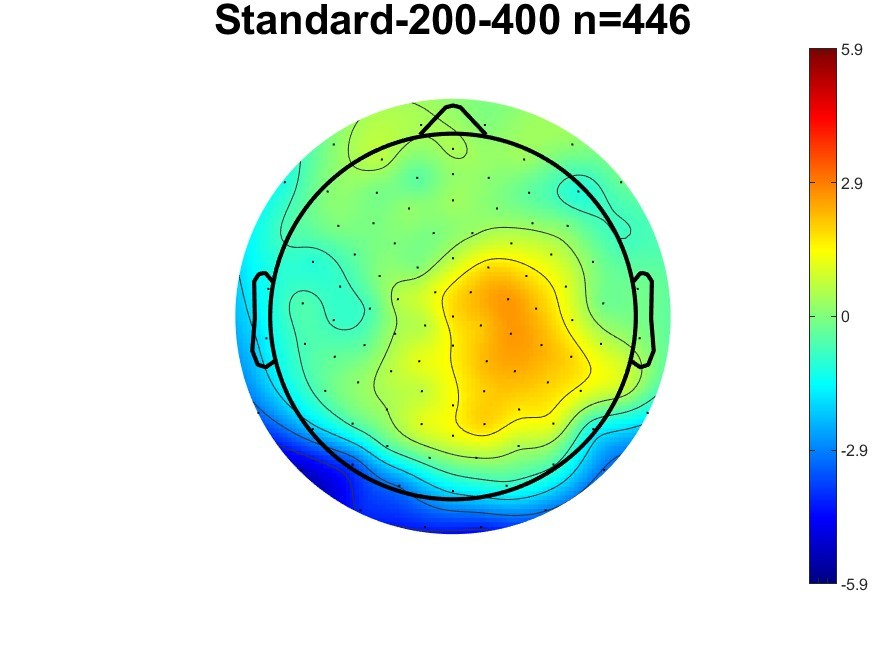
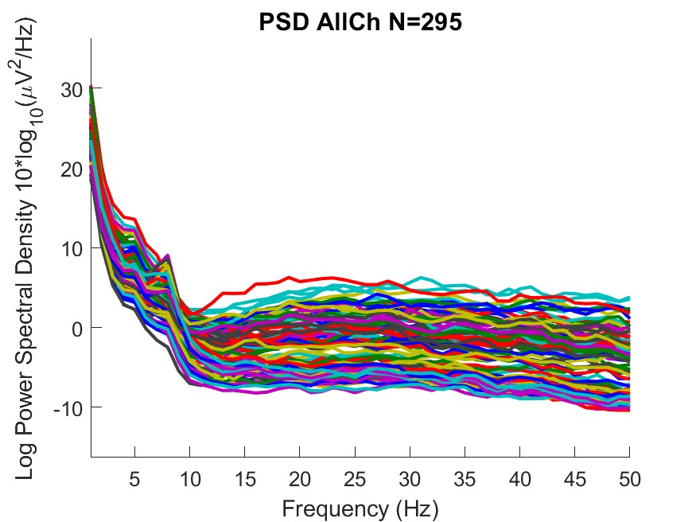
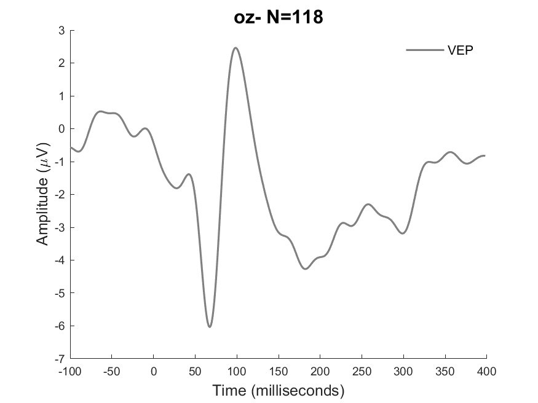
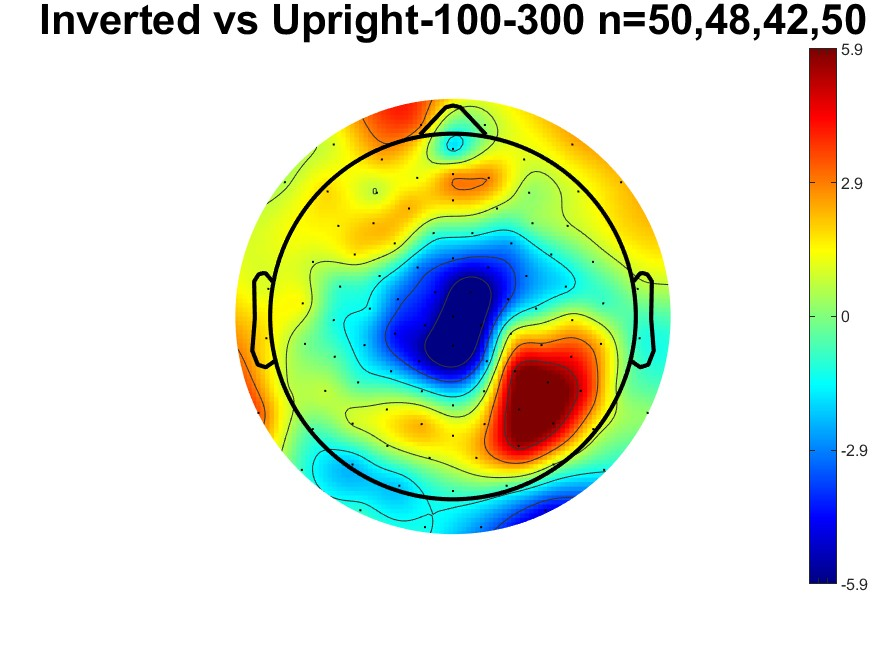
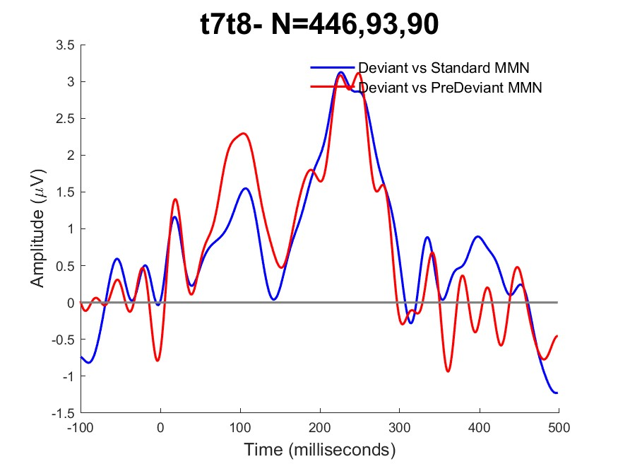

Expected Outputs
================

The output structure of HBCD-MADE will mimic the input BIDS structure. If you have some EEG file that is found under ``/bids_dir/sub-1/ses-1/eeg/``, then the output of HBCD-MADE will fall under ``output_dir/sub-1/ses-1/eeg/``. The output of HBCD-MADE will primarily be found in *.set EEGLAB formatted data structures. Different stages of data processing will be saved, but the final data elements to be used for subsequent analyses will be found under the ‘processed_data’ folder. If you load an EEG file, from the processed_data folder, it’s ‘data’ field will have dimensions <num_electrodes, num_samples, num_epochs>, with the epochs placed around the events specified in the json file. The .set/.fdt files saved by HBCD-MADE can be loaded back into Matlab with EEGLAB’s pop_loadset function, or loaded in python using MNE. 

 The following output folders and files are created throughout processing within each subject’s output directory:

- :ref:`./filtered_data <./filtered_data>`
- :ref:`./merged_data <./merged_data>` 
- :ref:`./ica_data <./ica_data>` 
- :ref:`./processed_data <./processed_data>` 
- :ref:`./...eeg_MADE_preprocessing_report.csv <./...eeg_MADE_preprocessing_report.csv>`
- :ref:`./...eeg_eeg_MADE_specification.csv <./...eeg_eeg_MADE_specification.csv>`

HBCD-MADE output contains the following file types:

- ``JPEG``- session-level topographic, spectral and ERP plots.
- ``MAT`` - MATLAB data files contain processing output.
- ``CSV``- comma separated value files store data in tabular format.
- ``JSON``- stores metadata and saves task-specific configuration settings in a format that is easy for users to read and edit.
- ``SET``- contains metadata and parameters for the EEG dataset, such as channel locations, sampling rate, and event information.
- ``FDT``- field data table (FDT) files contain EEG data resaved across different stages of processing.

.. _./filtered_data:

1. ``/filtered_data`` folder
-------------------------

**Description**

This folder contains all data saved early in the processing pipeline after filtering but prior to bad channel detection. These data have been subjected to the following operations:

- deletion of discontinuous data
- deletion of EKG channel(s) if present
- downsampling
- deletion of outer electrode ring
- filtering with 0.3 Hz high-pass with stopband of 0.1
- 60 Hz low-pass with 10 Hz transition band using a noncausal FIR filter

**Contents**

Each EEG task administered will have a corresponding ``.set`` and ``.fdt`` file stored within this folder.

.. _./merged_data: 

2. ``/merged_data`` folder
-----------------------

**Description**

Immediately after filtering tasks are merged together into one file and re-saved into this folder.

**Contents**

Tasks present in the merged ``.fdt`` file are listed in the corresponding ``.json`` file.

.. _./ica_data:

3. ``/ica_data`` folder
-------------------------

**Description**

These files are saved later in processing. After data are merged into one file, they undergo the following operations and are re-saved to the ``./ica_data`` folder:

- Run through FASTER algorithm for bad channel detection
- ICA preparation: 

	* Dataset copied and 1Hz high-pass applied to the copy
	* Broken into 1-s epochs for epoch-level rejection
	* Bad channels rejected
- ICA
- Run through adjustedADJUST to identify artifacted ICs- see Leach et al (2021) for details (wip add citation) 

**Contents**

The ./ica_data folder contains the following:
- ``./sub-*_ses-*_adjust_report``: describes how each independent component was labeled by the adjusted-ADJUST algorithm.
- ``./sub-*_ses-*_ica_data.fdt``: EEG data with ICA weights
- ``./sub-*_ses-*_ica_data.set``: corresponding .set file to the .fdt

.. _./processed_data:

4. ``/processed_data`` folder 
-------------------------

**Description** 

Each EEG file found in this folder will have a corresponding json file in the parent directory that specifies the settings that were used for the specific task.  These data are saved at the end of the processing pipeline after the following operations have occurred:

- ICA artifact removal

- Merged tasks separated and epoched

- Baseline correction

- Artifact rejection

- Interpolation of removed channels

- Re-referencing

**Contents**

This folder contains all processed data and MADE output, described in detail below:

a. EEG Data (``.fdt``, ``.set``)

There is one .fdt and one corresponding .set file for each task containing fully processed data.

b. CSV data files (``.csv``)

For each task, two .csv files are automatically produced by MADE: a summary statistics file and a trial measures file.

- Summary Statistics

	* For the MMN, VEP, and FACE tasks, the summaryStats file contains the standardized measurement error (SME) for a specified time range (e.g. 200-400 ms after stimulus presentation) at an ROI (e.g. fcz). The SME is a universal measure of data quality for ERP data. See Luck et al. (2021) for more information.

	* For the RS (resting state), the summaryStats file contains the SME and mean power at each frequency bin ranging from 1-50Hz.

.. list-table:: FACE Summary Statistics Output
   :widths: 31 50
   :header-rows: 1

   * - Variable Name
     - Description
   * - Condition
     - inverted, object, uprightInv, uprightObj
   * - NTrials
     - number of trials retained per condition
   * - SME_200-300_p8
     - SME during 200-300 ms at P8 cluster
   * - SME_75-125_oz
     - SME during 75-125 ms at Oz cluster
   * - SME_200-300_oz
     - SME during 200-300 ms at Oz cluster
   * - SME_325-625_oz
     - SME during 325-625 ms at Oz cluster

.. list-table:: VEP Summary Statistics Output
   :widths: 31 50
   :header-rows: 1

   * - Variable Name
     - Description
   * - Condition
     - VEP
   * - NTrials
     - number of trials retained
   * - SME_40-79_oz
     - SME during 40-79 ms at Oz cluster
   * - SME_80-140_oz
     - SME during 80-140 ms at Oz cluster
   * - SME_141-300_oz
     - SME during 141-300 ms at Oz cluster
 
.. list-table:: MMN Summary Statistics Output
   :widths: 31 50
   :header-rows: 1

   * - Variable Name
     - Description
   * - Condition
     - deviant, predeviant, standard
   * - NTrials
     - number of trials retained per condition
   * - SME_200-400_t7t8
     - SME during 200-400 ms at T7/T8 cluster
   * - SME_200-400_f7f8
     - SME during 200-400 ms at F7/F8 cluster
   * - SME_200-400_fcz
     - SME during 200-400 ms at FCz cluster

.. list-table:: RS Summary Statistics Output
   :widths: 31 50
   :header-rows: 1

   * - Variable Name
     - Description
   * - Frequency
     - 1 Hz bins from 1-50 Hz
   * - SME
     - SME in each frequency bin
   * - Mean_Power
     - Mean power in each frequency bin
   * - ID
     - subject ID

- Trial Measures 

	* For the MMN, VEP, and FACE tasks, the trialMeasures files contain trial-by-trial mean amplitudes across time ranges for different ROIs.

	* The RS does not have a trialMeasures file because this task does not contain trials.

c. MATLAB Data files (``.mat``) 

.mat files contain processing output.

- Output for the VEP, FACE, and MMN tasks contain the ``allData`` matrix, which is structured as Conditions x Electrodes x Timepoints.

- Output for the RS data contains the ``spectra_eo_db`` matrix, which is structured as Electrodes x Frequency. RS .mat output does not contain the time dimension.

d. Figures (``.jpg``)

.. note:: The following plots are based on data from an adult volunteer and were processed using a pipeline optimized for infant data. They do not represent typical infant results.

Several images containing plots and figures are automatically produced by MADE:

**I. Topographic maps show the average distribution of voltages across the scalp during a specified time window.**

Example: Topo_Standard_MMN.jpg
	Topographic map of average brain response 200-400 ms after presentation of standard stimulus during auditory mismatch negativity task across 446 trials. 

**II. PSD plots represent the power spectral density at either all electrodes or specific regions of interest (ROIs). The number of trials represented are specified in the plot’s title.**

Example: PSD_AllCh.jpg
	Power spectral density plot for all channels across 295 retained epochs (1s each).

**III. ERP plots show the event-related potential wave across N trials at a specified ROI.**

Example: ERP_oz_VEP.jpg
	ERP plot of visual evoked potential at Oz electrode cluster, averaged across 118 trials. 

**IV. Topo plots contain topographic maps of mean voltage across the scalp during a specified time window.**

Example: Topo_Standard_MMN.jpg
	Topographic plot of EEG between 200-400 ms after presentation of standard stimulus during mismatch negativity task.
	
**V. DiffTop plots represent the difference in mean voltage between two conditions during a specified time window.**

Example: DiffTop_Inv_Vs_Upr_FACE.jpg
	Average difference in scalp distribution between 100-300 ms after presentation of Inverted vs Upright faces. For this task, 50 upright face trials were retained in the Upright/Inverted block, 48 inverted face trials were retained in the Upright/Inverted face block, 42 Object trials were retained in the Object/Upright face block, and 50 upright face trials were retained in the Object/Upright face block. For this plot, only the first two n values are relevant because the plot represents the difference between Inverted and Upright faces. 

**VI. DiffERP plots display the difference in the ERP waveform between specified conditions.**

	Example: DiffERP_t7t8_MMN.jpg
	Difference waves for ERP reponses to stimuli during auditory mismatch negativity task at T7/T8 electrode cluster. 446 standard trials, 93 pre-deviant, and 90 deviant trials are represented. 

.. note:: Plot titles contain N values for the number of trials retained for each condition of each task. MMN task plots are titled as follows: N = # standard trials, # predeviant trials, # deviant trials. FACE task plots are titled as follows: N = # uprightINV trials, # inverted trials, # object trials, # uprightOBJ trials.

.. _./...eeg_MADE_preprocessing_report.csv:

5. ``./...MADE_preprocessing_report.csv``
-------------------------------------------------------

Processing report automatically generated by MADE. The file ``MADE_preprocessing_report.csv`` will contain summary level statistics related to the processing of your data. Because the EEG data is merged across tasks for portions of the pre-processing, some of these entries will be the same for all tasks. See Debnath et al. (2021) for more information on MADE preprocessing. The following variables are represented-

.. list-table:: Processing Report Output
   :widths: 31 50
   :header-rows: 1

   * - Variable Name
     - Description
   * - datafile_name
     - file name of EEG data
   * - subject_id
     - unique subject identifier
   * - task
     - FACE, MMN, RS, VEP
   * - line_noise
     - estimate of how much electrical line noise is present in the EEG signal. Values of 1 indicate no line noise, values of 0 indicate pure line noise.
   * - reference_for_faster
     - reference electrode used by the FASTER algorithm used for bad channel detection (Nolan et al., 2010).
   * - faster_bad_channels
     - list of channels identified by FASTER algorithm as being artifactual, or not representative of brain activity.
   * - ica_prep_bad_channels
     - channels deleted by FASTER before ICA.
   * - length_ica_data
     - how much continuous data (in seconds) was used for independent component analysis.
   * - total_ICs
     - number of independent components identified.
   * - ICs_removed
     - independent components removed by adjusted-ADJUST (Leach et al, 2020).
   * - total_epochs_pre_artifact_rej
     -  number of epochs collected.
   * - total_epochs_post_artifact_rej
     - number of epochs retained after epoch-level artifact rejection.
   * - total_channels_interp
     - number of channels interpolated using spline interpolation after bad channel removal.
   * - avg_chan_interp_artifact_rej
     - average number of channels interpolated per epoch using spline interpolation for each task.
   * - std_chan_interp_artifact_rej
     - standard deviation of the number of channels removed per epoch for each task.
   * - range_chan_interp_artifact_rej
     - range of number of channels interpolated per epoch.

The following variables within the MADE processing report represent the number of trials retained after artifact rejection from each condition of each task.

.. list-table:: Processing Report Output- Trials Retained
   :widths: 20 8 50
   :header-rows: 1

   * - Variable Name
     - Task
     - Description
   * - FACE_UpInv
     - FACE
     - face stimuli in block 1 (upright faces vs inverted faces)
   * - FACE_Inv
     - FACE
     - inverted face stimuli in block 1 (upright faces vs inverted faces)
   * - FACE_Obj
     - FACE
     - object stimuli in block 2 (upright faces vs objects)
   * - FACE_UpObj
     - FACE
     - FACE task, upright face stimuli in block 2 (upright faces vs objects)
   * - MMN_Standard
     - MMN
     - mismatch negativity, standard stimulus
   * - MMN_PreDev
     - MMN
     - mismatch negativity, standard stimulus preceding deviant stimulus
   * - MMN_Dev
     - MMN
     - mismatch negativity, deviant stimulus

.. _./...eeg_eeg_MADE_specification.csv:

6. ``...MADE_specification.csv``
--------------------------------------------------------------------

A unique .json is produced for each task processed by HBCD-MADE and titled according to the task it represents. These files serve as a reference for the parameters used to process each task. For definitions of each parameter listed, see :doc:`Processing Settings and Configuration </json_configuration>`

.. toctree::
   :maxdepth: 2
   :caption: Contents:
      
      