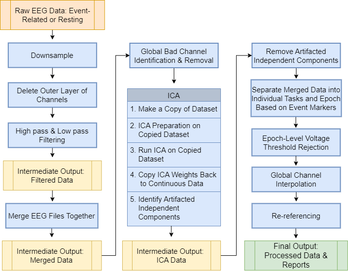

.. HBCD_EEG_MADE documentation master file, created by
   sphinx-quickstart on Mon May 16 10:41:56 2022.
   You can adapt this file completely to your liking, but it should at least
   contain the root `toctree` directive.

.. include:: links.rst

.. _citation:

HBCD-MADE- an automated developmental EEG preprocessing pipeline 
==================================================================

.. image:: https://img.shields.io/badge/Psychophysiology-10.1038%2Fs41592--021--01185--5-purple
  :target: https://doi.org/10.1111/psyp.13580
  :alt: Publication DOI

.. image:: https://img.shields.io/badge/License-GNU--Public--License-green
  :target: https://github.com/ChildDevLab/HBCD-MADE?tab=GPL-3.0-1-ov-file#readme
  :alt: License

This page serves as documentation for the HBCD-MADE pipeline, an adapted version of the Maryland Analysis of Developmental EEG (MADE) pipeline (Debnath et al., 2020) designed for use with data from the Healthy Brain and Child Development (HBCD) study. The GitHub repository for the MADE pipeline upon which HBCD-MADE is based can be found `here <https://github.com/ChildDevLab/MADE-EEG-preprocessing-pipeline>`_, and a publication describing the original pipeline can be found `here <https://onlinelibrary.wiley.com/doi/full/10.1111/psyp.13580>`_. The documentation for the HBCD-MADE pipeline can be found `here <https://docs-hbcd-made.readthedocs.io/en/latest/index.html>`_. 

The HBCD-MADE pipeline will run preprocessing on BIDS-formatted data with most EEG files being the .set file format. All metadata required for running the HBCD-MADE pipeline is present within the .set files themselves, and other BIDS metadata will not be referenced during processing. In general, HBCD-MADE's functionality is roughly as follows:

#. **Identify all session-level EEG data for a given
   recording session.**
#. **Iterate through all EEG files for the identified session,
   downsample the data, delete the outer layer of channels (which are often noisy in infant populations),
   and filter each file with the desired high-pass/low-pass settings.**
#. **Merge all task files together.**
#. **Check whether any electrodes are outliers at the session level.  This is done by using FASTER (Nolan, 2010). In short, for each electrode, the following measures will be calculated to judge outlier status, and any electrodes that have deviations greater than 3 SDs on any given measure will be excluded from further analysis:**
   
   * The average temporal correlation to other electrodes
   * The Hurst exponent (measuring the self-similarity within each electrode's
     time signal
   * The signal variance
   
#. **Run through ICA on the electrodes:** 

   * Create a temporary copy of the EEG signal
     high passed at 1Hz for ICA
   * Create 1s epochs and remove those with
     outlier characteristics
   * Generate independent components (ICs) on good electrodes and
     good epochs
   * Classify the ICs into categories (such
     as blink) based on spatial and temporal characteristics
   * Subtract the bad ICs from the original data
#. **Separate the merged data back into individual tasks**
#. **Epoch task-based data based on event markers**
#. **Remove epochs that still have high voltage fluctuations.**
#. **Interpolate over bad channels within epochs.**
#. **Interpolate deleted channels across epochs.**
#. **Re-reference the data to the average reference.**
#. **Save the final output consisting of cleaned and epoched EEG data.**

Contributors
------------

**Original Contributors to MADE pipeline:**

- Ranjan Debnath (rdebnath@umd.edu)
- George A. Buzzell (gbuzzell@umd.edu)
- Santiago Morales Pamplona (moraless@umd.edu)
- Stephanie Leach (sleach12@umd.edu)
- Maureen Elizabeth Bowers (mbowers1@umd.edu)
- Nathan A. Fox (fox@umd.edu)

**Past Contributors:** 

- Martin Antunez Garcia (mantunez@umd.edu)
- Lydia Yoder (lyoder@umd.edu)

**Ongoing Contributors:**

- Erik Lee (eex6144@umn.edu)
- Jessica Norris (jnorri10@umd.edu)
- Kira Ashton (kashton7@umd.edu)
- Marco McSweeney (mmcsw1@umd.edu)
- Savannah McNair (smcnair1@umd.edu)
- Trisha Maheshwari (tmahesh@umd.edu)
- Whitney Kasenetz (kasenetz@umd.edu)

.. toctree::
   :maxdepth: 2
   :caption: Contents:
   
Contents
--------

.. toctree::

   container_info
   data_requirements
   json_configuration
   expected_outputs
   task_info
   resources
   appendix

.. [Nolan2010] Nolan, H., Whelan, R., & Reilly, R. B. (2010). Faster: Fully automated statistical Thresholding for EEG artifact rejection. Journal of Neuroscience Methods, 192(1), 152–162. `<https://doi.org/10.1016/j.jneumeth.2010.07.015>`_.

