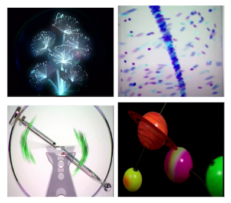
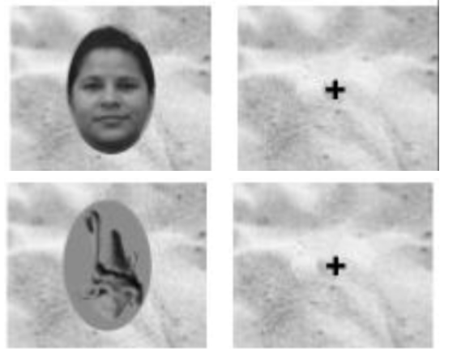
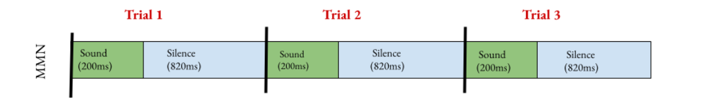
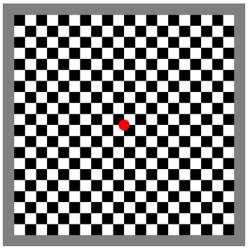

HBCD EEG Task Information
==========================

1. Resting State 
------------------

Abbreviation
	RS, Baseline

Construct
	The Resting State Task provides information about neural oscillations and dynamics between oscillatory rhythms across development. Ontogenetic changes in oscillatory activity reflect underlying developing large scale neural networks associated with early critical self-regulatory, cognitive, and affective processes and developmental outcomes.

Description
	In V03, a silent video with a variety of colorful and abstract toys and visuals on screen. The child watches the video for the duration of the task. 

	In V04/6, a silent video with a variety of marble run and construction visuals on screen. The child watches the video for the duration of the task.

**Visits Administered and corresponding age range of administration:**

- V03: 3-9 months
- V04: 9-15 months
- V06: 15-48 months

**Estimated length of time for completion:** Approximately 3 minutes.

2. Face Task 
-------------

Abbreviation
	FACE			

Construct
	The Face task assesses child and infant face processing abilities as well as the neural structures supporting face and object processing become increasingly specialized during the first years of life. ERPs will be recorded while infants view faces and objects using an oddball task designed to index different stages of processing including attention, perception, categorization, individuation and memory. 

Description
	The task consists of 2 blocks: 50 trials of upright faces & 50 trials of inverted faces and 50 trials of upright faces & 50 trials of objects. If the child loses attention, an attention getter may be played to bring the child’s focus back to the task. There are a total of 36 unique images in the set, with women all displaying neutral expressions, included from each of the following self identifying demographics: Indigenous, Black, White, Asian, Hispanic/Latino, South Asian. 

**Trial Count**

- Block 1: 50 trials of upright faces (UprightINV)
- Block 1: 50 trials of inverted faces (Inverted)
- Block 2: 50 trials of upright faces (UprightOBJ)
- Block 2: 50 trials of obkects. (Object)

**Timing Details**

- Stimulus duration: 500 ms
- Interstimulus interval: 600-700 ms
- Total trial length: 110-1200 ms

**Visits Administered and corresponding age range of administration:**

- V03: 3-9 months
- V04: 9-15 months
- V06: 15-48 months

**Estimated length of time for completion:** Approximately 5 minutes.

3. Auditory Mismatch Negativity Task 
-------------------------------------

Abbreviation 
	MMN

Construct
	The Auditory mismatch negativity (MMN) Task facilitates examining auditory evoked potentials, habituation/dishabituation to auditory stimuli, as well as perceptual narrowing in language processing. Speech stimuli have been shown to be an important index of future language abilities.

Description
	An auditory presentation of English syllables “ba” and “da”. Video played on iPad as a distractor with brightness all the way up, airplane mode, and not plugged in. The task may be paused if breaks are needed. The .wav files for the auditory stimuli are 196 ms long for the "ba" stimulus and 198 ms long for the "da" stimulus.

**Visits Administered and corresponding age range of administration:**

- V03: 3-9 months
- V04: 9-15 months
- V06: 15-48 months

**Estimated length of time for completion:** Approximately 12 minutes (V03) or 9 minutes (V04/6).

**Trial Count**

- Standard condition: 569 
- Deviant condition: 98 
- Total: 667

**Timing Details**

- Stimulus duration: 200 ms
- InterStimulus interval: 820 ms (V03), 600 ms (V04/V06)
- Total trial length: 1020 ms (V03), 800 (V04/V06)

A schematic of the trial progression for Visit 3 is below.

4. Visual Evoked Potential Task 
--------------------------------

Abbreviation
	VEP

Construct
	The Visual Evoked Potential Task (VEP) is a measurement of the primary visual cortex response to visual stimuli. VEP amplitude and latency decreases with age during the first three years of life and has been associated with concurrent and later developmental measures. In addition, the morphology of the VEP likely reflects varying degrees of synaptic efficiency and as such, can be used as a readout of general cortical function.

Description
	A flashing black and white 20x20 checkerboard with a red circle in the center is shown for the duration of the task.

**Visits Administered and corresponding age range of administration:**

- V03: 3-9 months
- V04: 9-15 months
- V06: 15-48 months

**Estimated length of time for completion:** Approximately 1 minute. 

**Trial Counts:** 

- Checkerboard A: 60
- Checkerboard B: 60
- Total: 120

**Timing Details**

- Stimulus duration: 500ms
- Interstimulus interval: N/A
- Total trial length: 500ms
